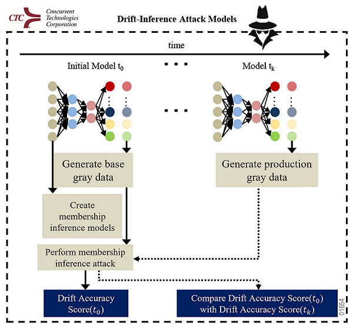

# Image-Based Model Drift Detection Using Model Inversion and Membership Inference Attacks

## Abstract

&emsp; While machine learning models are becoming more popular among computer security applications, the issue of model precision and accuracy over time has also increased. Model drift occurs when a machine learning model’s performance worsens over time caused by changes to the dataset on which the model is being tested (i.e., data drift) or changes to the model’s definition of a feature (i.e., concept drift). Detecting model drift can decrease or even resolve model drift, ensuring precision and accuracy over time. It has been shown to be relatively simple to detect and correct model drift with numerical data, yet more difficult for image-based data. Most current model drift detection relies on statistical analysis of a model’s test accuracies over time; however, this work detects model drift for image-based data even when a model’s test accuracy does not indicate the existence of model drift. Our approach first utilizes model inversion to create gray data that captures a model’s average interpretation of the data’s features then deploys Membership Inference Attacks (MIAs)—typically used to address privacy concerns of released machine learning models—to determine whether that gray data can be correctly recognized by the model. The combination of these tools ascertains whether a model’s definition of a feature or class has changed, indicating the occurrence of model drift. Several open-source image-based datasets are used to evaluate and demonstrate the effectiveness and scalability of this novel approach, proving the ability of model inversion and MIAs as defensive and remedial measures in machine learning models.

## Description of Method

This approach will detect model drift in the base model by inverting the base model and a newer iteration of the base model (the production model) then attacking the base model with the inversion of both the base model and the production model.

Both model inversion and membership inference attacks are deployed in this method to gather a more comprehensive picture of if and how a model has drifted.

We will follow the pipeline as shown in the image below:

## Definitions

### Model Drift

*Model drift* describes the event where the performance of a machine learning model worsens over time.

The most common causes of model drift occur when there are changes to the dataset on which the model is being tested (*data drift*) or when the definition of a feature within the model is changed (*concept drift*).

*Data drift* occurs when the data that is run on the model has changed from the original dataset.

*Concept drift* occurs when the model’s awareness of a certain feature changes (i.e., a new concept for classification of a given feature is recognized by the model.)

### Model Inversion and Gray Data

*Model inversion* attacks use a classifier to attempt to recreate the training data given to a model as gray data, which is human-uninterpretable data that represents a model's training data.

### Membership Inference Attacks

*Membership inference attacks* (MIAs) aim to predict if a specific instance of data was used in the training data for the model. To do this, MIA's use shadow models created by feeding random examples the model to determine key features